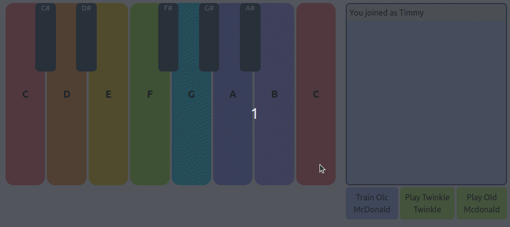

# Children's MIDI Keyboard Project

## Introduction

Welcome to the Children's MIDI Keyboard Project repository! This educational tool combines modern web technologies to create an interactive musical experience for children. It uses HTML, Tailwind CSS for styling, WebSockets for real-time communication, the OpenAI API for evaluation, and the JavaScript Web Audio API for sound synthesis. With this MIDI keyboard, kids can enjoy playing melodies, learning songs like "Twinkle Twinkle Little Star" and "Old MacDonald Had a Farm," and even receive feedback on their performance through OpenAI's assessment capabilities.

## Features

- Interactive keyboard interface designed with children in mind
- Use your mouse, keyboard or MIDI keyboard to interact with the keys.
- Preloaded melodies for instant play: "Twinkle Twinkle," "Old McDonald," and more
- Real-time performance evaluation using OpenAI
- Train mode that teaches song sequences and validates user input
- Responsive design powered by Tailwind CSS for an optimal experience across devices
- WebSocket-based communication for a seamless user interaction

